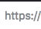
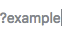

# Parsing the URL

``protocol://host:port/path?query``

The browser now has the following information from the URL ([Uniform Resource Locator](https://tools.ietf.org/html/rfc1738)):

### Protocol

Is this HTTP/S or some other protocol (ftp://, gopher://, smb://, etc)?

### Host

What is the host that holds the resource?

### Path

What is the path the resource we are attempting to locate?

### Query Parameters

Are there query parameters that should be passed to the responding web server?

### Convert non-ASCII Unicode characters in hostname

* The browser checks the hostname for characters that are not in `a-z`,
  `A-Z`, `0-9`, `-`, or `.`.

* Since the hostname is `google.com` there won't be any, but if there were
  the browser would apply [Punycode](https://en.wikipedia.org/wiki/Punycode) encoding to the hostname portion of the URL.

[Checking the HSTS list](./2-CheckingHSTS.md)