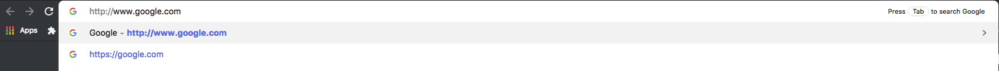

# What Happens When...



## Introduction

Today's exercise is an attempt to answer the age old interview question "What happens when you type a URL in your browser's address box and hit _enter_?".

The point of this question in an interview is to test how the candidate can articulate and link the various layers of the HTTP request/response process across domains of IT knowledge. For today's exercise, we will narrow that down a bit to focus on the parts of the stack that will be applicable to ASEs.

I will attempt to demoonstrate each step that discuss (within reason) using [wireshark](https://www.wireshark.org/download.html), command line tools, and browser tools/developer mode.

```Start Wireshark capture at this time```

## Skipping over the keyboard

Some answers to this question will go into excrutiating detail about physical key presses, OS interupts, etc. 

```
...the Enter key bottoms out on the keyboard, an electrical circuit is closed (either directly or capacitively), current flows into the logic circuitry of the keyboard ...
```

We're not concerned about physical processes for this session. Suffice to say that the input (_www.google.com_) was populated in the browser bar. The _Enter_ key has been pressed.

# Parsing the URL


The browser now has the following information from the URL ([Uniform Resource Locator](https://tools.ietf.org/html/rfc1738)):

### Protocol


Is this HTTP/S or some other protocol (ftp://, gopher://, smb://, etc)?

### Host


What is the host that holds the resource?

### Path


What is the path the resource we are attempting to locate?

### Query Parameters


Are there query parameters that should be passed to the responding web server?

### Convert non-ASCII Unicode characters in hostname

* The browser checks the hostname for characters that are not in `a-z`,
  `A-Z`, `0-9`, `-`, or `.`.

* Since the hostname is `google.com` there won't be any, but if there were
  the browser would apply [Punycode](https://en.wikipedia.org/wiki/Punycode) encoding to the hostname portion of the URL.

# Check HSTS list

* The browser checks its "preloaded HSTS ([HTTP Strict Transport Security](https://tools.ietf.org/html/rfc6797))" list. This is a list of websites that have requested to be contacted via HTTPS only.

* If the website is in the list, the browser sends its request via HTTPS instead of HTTP. Otherwise, the initial request is sent via HTTP.

_Demo: View HSTS config for google.com in Chrome_
* Launch Chrome net-internals hsts config page.
``chrome://net-internals/#hsts``
* Search for google.com domain in the 'Query HSTS/PKP domain' field

# DNS lookup

* Browser checks if the domain is in its cache.
* If not found, the browser calls ``gethostbyname`` library function (varies by
  OS) to do the lookup.
* ``gethostbyname`` checks if the hostname can be resolved by reference in the
  local ``hosts`` file (whose location `varies by OS`_) before trying to
  resolve the hostname through DNS.
* If ``gethostbyname`` does not have it cached nor can find it in the ``hosts``
  file then it makes a request to the DNS server configured in the network
  stack. This is typically the local router or the ISP's caching DNS server.
* If the DNS server is on the same subnet the network library follows the
  ``ARP process`` below for the DNS server.
* If the DNS server is on a different subnet, the network library follows
  the ``ARP process`` below for the default gateway IP.

_Demo_
* Launch Chrome net-internals DNS config, clear DNS cache
``chrome://net-internals/#dns``
* Check ``/etc/host`` file
```bash 
cat /etc/hosts
```
* clear DNS cache (cmd is for OSX)
```bash
$ sudo killall -HUP mDNSResponder;sudo killall mDNSResponderHelper;sudo dscacheutil -flushcache
```

# ARP process

In order to send an ARP ([Address Resolution Protocol](https://tools.ietf.org/html/rfc826)) broadcast the network stack library needs the target IP address to look up. It also needs to know the MAC address of the interface it will use to send out the ARP broadcast.

The ARP cache is first checked for an ARP entry for our target IP. If it is in the cache, the library function returns the result: Target IP = MAC.

If the entry is not in the ARP cache:

* The route table is looked up, to see if the Target IP address is on any of the subnets on the local route table. If it is, the library uses the interface associated with that subnet. If it is not, the library uses the interface that has the subnet of our default gateway.

* The MAC address of the selected network interface is looked up.

* The network library sends a Layer 2 (data link layer of the `OSI model`)

Depending on what type of hardware is between the computer and the router determines the next step. If directly connected the router will answer with an ``ARP Reply``. If connected to a hub then your compute belongs in 1995 but your ARP request will be sent out all the hub ports and the router will respond with an ``ARP reply``. 

Most likely, your computer is connected to a switch. 

* The switch will check its local CAM/MAC table to see which port has the MAC address we are looking for. If the switch has no entry for the MAC address it will rebroadcast the ARP request to all other ports.
* If the switch has an entry in the MAC/CAM table it will send the ARP request to the port that has the MAC address we are looking for.
* Presumably the router is on the same L2 broadcast domain and will respond with an ``ARP Reply``.

_DEMO_
* Show the arp cache
```bash
$ arp -a
```
* Show Wireshark filter for arps to/from the default gateway
``arp.src.proto_ipv4 == 10.10.0.1``

### Back to DNS Resolution
Now that the network library has the IP address of either our DNS server or the default gateway it can resume the DNS resolution process:

* Port 53 is opened to send a UDP request to a DNS server (if the response size is too large, TCP will be used instead).
* If the local/ISP DNS server does not have the entry, then a recursive search is requested and that flows up the list of DNS servers until the SOA (Start of Authority) is reached, and if found an answer is returned.


_DEMO_
* Show Wireshark filer for DNS query
``dns.qry.name == "www.google.com"``

# Opening of a socket

Once the browser receives the IP address of the destination server, it takes that and the given port number from the URL (the HTTP protocol defaults to port 80, and HTTPS to port 443), and makes a call to the system library function named ``socket`` and requests a TCP socket stream - ``AF_INET/AF_INET6`` and ``SOCK_STREAM``.

* This request is first passed to the Transport Layer where a TCP segment is crafted. The destination port is added to the header, and a source port is chosen from within the kernel's dynamic port range (ip_local_port_range in Linux).

* This segment is sent to the Network Layer, which wraps an additional IP header. The IP address of the destination server as well as that of the current machine is inserted to form a packet.

* The packet next arrives at the Link Layer. A frame header is added that includes the MAC address of the machine's NIC as well as the MAC address of the gateway (local router). 

* As before, if the kernel does not know the MAC address of the gateway, it must broadcast an ARP query to find it (_but in this case the ARP entry is cached as we've just looked it up/constantly been using it_). 

_DEMO_
* Show the established connection (refer to Wireshark for resolved destination IP address)
```bash
$ netstat -an | grep 216.58.192.196
```

# Packets Hit the "Wire"
At this point the packet is ready to be transmitted through either:

* `Ethernet`_
* `WiFi`_
* `Cellular data network`_

For most home or small business Internet connections the packet will pass from
your computer, possibly through a local network, and then through a modem
(MOdulator/DEModulator) which converts digital 1's and 0's into an analog
signal suitable for transmission over telephone, cable, or wireless telephony
connections. On the other end of the connection is another modem which converts
the analog signal back into digital data to be processed by the next `network
node`_ where the from and to addresses would be analyzed further.

Most larger businesses and some newer residential connections will have fiber
or direct Ethernet connections in which case the data remains digital and
is passed directly to the next `network node`_ for processing.

Eventually, the packet will reach the router managing the local subnet. From
there, it will continue to travel to the autonomous system's (AS) border
routers, other ASes, and finally to the destination server. Each router along
the way extracts the destination address from the IP header and routes it to
the appropriate next hop. The time to live (TTL) field in the IP header is
decremented by one for each router that passes. The packet will be dropped if
the TTL field reaches zero or if the current router has no space in its queue
(perhaps due to network congestion).

This send and receive happens multiple times following the TCP connection flow:

* Client chooses an initial sequence number (ISN) and sends the packet to the
  server with the SYN bit set to indicate it is setting the ISN
* Server receives SYN and if it's in an agreeable mood:
   * Server chooses its own initial sequence number
   * Server sets SYN to indicate it is choosing its ISN
   * Server copies the (client ISN +1) to its ACK field and adds the ACK flag
     to indicate it is acknowledging receipt of the first packet
* Client acknowledges the connection by sending a packet:
   * Increases its own sequence number
   * Increases the receiver acknowledgment number
   * Sets ACK field
* Data is transferred as follows:
   * As one side sends N data bytes, it increases its SEQ by that number
   * When the other side acknowledges receipt of that packet (or a string of
     packets), it sends an ACK packet with the ACK value equal to the last
     received sequence from the other
* To close the connection:
   * The closer sends a FIN packet
   * The other sides ACKs the FIN packet and sends its own FIN
   * The closer acknowledges the other side's FIN with an ACK

_DEMO_
* Show Wireshark filter for SYNs, follow conversation to show 3WH
``tcp.flags.syn==1 && tcp.flags.ack==0``


## TLS handshake

* The client computer sends a ``ClientHello`` message to the server with its
  Transport Layer Security (TLS) version, list of cipher algorithms and
  compression methods available.

* The server replies with a ``ServerHello`` message to the client with the
  TLS version, selected cipher, selected compression methods and the server's
  public certificate signed by a CA (Certificate Authority). The certificate
  contains a public key that will be used by the client to encrypt the rest of
  the handshake until a symmetric key can be agreed upon.

* The client verifies the server digital certificate against its list of
  trusted CAs. If trust can be established based on the CA, the client
  generates a string of pseudo-random bytes and encrypts this with the server's
  public key. These random bytes can be used to determine the symmetric key.

* The server decrypts the random bytes using its private key and uses these
  bytes to generate its own copy of the symmetric master key.

* The client sends a ``Finished`` message to the server, encrypting a hash of
  the transmission up to this point with the symmetric key.

* The server generates its own hash, and then decrypts the client-sent hash
  to verify that it matches. If it does, it sends its own ``Finished`` message
  to the client, also encrypted with the symmetric key.

* From now on the TLS session transmits the application (HTTP) data encrypted
  with the agreed symmetric key.

## HTTP protocol

If the web browser used was written by Google, instead of sending an HTTP
request to retrieve the page, it will send a request to try and negotiate with
the server an "upgrade" from HTTP to the SPDY protocol.

If the client is using the HTTP protocol and does not support SPDY, it sends a
request to the server of the form::

    GET / HTTP/1.1
    Host: google.com
    Connection: close
    [other headers]

where ``[other headers]`` refers to a series of colon-separated key-value pairs
formatted as per the HTTP specification and separated by single new lines.
(This assumes the web browser being used doesn't have any bugs violating the
HTTP spec. This also assumes that the web browser is using ``HTTP/1.1``,
otherwise it may not include the ``Host`` header in the request and the version
specified in the ``GET`` request will either be ``HTTP/1.0`` or ``HTTP/0.9``.)

HTTP/1.1 defines the "close" connection option for the sender to signal that
the connection will be closed after completion of the response. For example,

    Connection: close

HTTP/1.1 applications that do not support persistent connections MUST include
the "close" connection option in every message.

After sending the request and headers, the web browser sends a single blank
newline to the server indicating that the content of the request is done.

The server responds with a response code denoting the status of the request and
responds with a response of the form::

    200 OK
    [response headers]

Followed by a single newline, and then sends a payload of the HTML content of
``www.google.com``. The server may then either close the connection, or if
headers sent by the client requested it, keep the connection open to be reused
for further requests.

If the HTTP headers sent by the web browser included sufficient information for
the web server to determine if the version of the file cached by the web
browser has been unmodified since the last retrieval (ie. if the web browser
included an ``ETag`` header), it may instead respond with a request of
the form::

    304 Not Modified
    [response headers]

and no payload, and the web browser instead retrieves the HTML from its cache.

After parsing the HTML, the web browser (and server) repeats this process
for every resource (image, CSS, favicon.ico, etc) referenced by the HTML page,
except instead of ``GET / HTTP/1.1`` the request will be
``GET /$(URL relative to www.google.com) HTTP/1.1``.

If the HTML referenced a resource on a different domain than
``www.google.com``, the web browser goes back to the steps involved in
resolving the other domain, and follows all steps up to this point for that
domain. The ``Host`` header in the request will be set to the appropriate
server name instead of ``google.com``.

## HTTP Server Request Handle

The HTTPD (HTTP Daemon) server is the one handling the requests/responses on
the server side. The most common HTTPD servers are Apache or nginx for Linux
and IIS for Windows.

* The HTTPD (HTTP Daemon) receives the request.
* The server breaks down the request to the following parameters:
   * HTTP Request Method (either ``GET``, ``HEAD``, ``POST``, ``PUT``,
     ``DELETE``, ``CONNECT``, ``OPTIONS``, or ``TRACE``). In the case of a URL
     entered directly into the address bar, this will be ``GET``.
   * Domain, in this case - google.com.
   * Requested path/page, in this case - / (as no specific path/page was
     requested, / is the default path).
* The server verifies that there is a Virtual Host configured on the server
  that corresponds with google.com.
* The server verifies that google.com can accept GET requests.
* The server verifies that the client is allowed to use this method
  (by IP, authentication, etc.).
* If the server has a rewrite module installed (like mod_rewrite for Apache or
  URL Rewrite for IIS), it tries to match the request against one of the
  configured rules. If a matching rule is found, the server uses that rule to
  rewrite the request.
* The server goes to pull the content that corresponds with the request,
  in our case it will fall back to the index file, as "/" is the main file
  (some cases can override this, but this is the most common method).
* The server parses the file according to the handler. If Google
  is running on PHP, the server uses PHP to interpret the index file, and
  streams the output to the client.

## Behind the scenes of the Browser

Once the server supplies the resources (HTML, CSS, JS, images, etc.)
to the browser it undergoes the below process:

* Parsing - HTML, CSS, JS
* Rendering - Construct DOM Tree → Render Tree → Layout of Render Tree →
  Painting the render tree

## HTML parsing

The rendering engine starts getting the contents of the requested
document from the networking layer. This will usually be done in 8kB chunks.

The primary job of HTML parser to parse the HTML markup into a parse tree.

The output tree (the "parse tree") is a tree of DOM element and attribute
nodes. DOM is short for Document Object Model. It is the object presentation
of the HTML document and the interface of HTML elements to the outside world
like JavaScript. The root of the tree is the "Document" object. Prior of
any manipulation via scripting, the DOM has an almost one-to-one relation to the markup.

### The parsing algorithm

HTML cannot be parsed using the regular top-down or bottom-up parsers.

The reasons are:

* The forgiving nature of the language.
* The fact that browsers have traditional error tolerance to support well
  known cases of invalid HTML.
* The parsing process is reentrant. For other languages, the source doesn't
  change during parsing, but in HTML, dynamic code (such as script elements
  containing `document.write()` calls) can add extra tokens, so the parsing
  process actually modifies the input.

Unable to use the regular parsing techniques, the browser utilizes a custom
parser for parsing HTML. The parsing algorithm is described in
detail by the HTML5 specification.

The algorithm consists of two stages: tokenization and tree construction.

### Actions when the parsing is finished

The browser begins fetching external resources linked to the page (CSS, images,
JavaScript files, etc.).

At this stage the browser marks the document as interactive and starts
parsing scripts that are in "deferred" mode: those that should be
executed after the document is parsed. The document state is
set to "complete" and a "load" event is fired.

Note there is never an "Invalid Syntax" error on an HTML page. Browsers fix
any invalid content and go on.

### CSS interpretation

* Parse CSS files, ``<style>`` tag contents, and ``style`` attribute
  values using `"CSS lexical and syntax grammar"`_
* Each CSS file is parsed into a ``StyleSheet object``, where each object
  contains CSS rules with selectors and objects corresponding CSS grammar.
* A CSS parser can be top-down or bottom-up when a specific parser generator
  is used.

### Page Rendering

* Create a 'Frame Tree' or 'Render Tree' by traversing the DOM nodes, and
  calculating the CSS style values for each node.
* Calculate the preferred width of each node in the 'Frame Tree' bottom up
  by summing the preferred width of the child nodes and the node's
  horizontal margins, borders, and padding.
* Calculate the actual width of each node top-down by allocating each node's
  available width to its children.
* Calculate the height of each node bottom-up by applying text wrapping and
  summing the child node heights and the node's margins, borders, and padding.
* Calculate the coordinates of each node using the information calculated
  above.
* More complicated steps are taken when elements are ``floated``,
  positioned ``absolutely`` or ``relatively``, or other complex features
  are used. See
  http://dev.w3.org/csswg/css2/ and http://www.w3.org/Style/CSS/current-work
  for more details.
* Create layers to describe which parts of the page can be animated as a group
  without being re-rasterized. Each frame/render object is assigned to a layer.
* Textures are allocated for each layer of the page.
* The frame/render objects for each layer are traversed and drawing commands
  are executed for their respective layer. This may be rasterized by the CPU
  or drawn on the GPU directly using D2D/SkiaGL.
* All of the above steps may reuse calculated values from the last time the
  webpage was rendered, so that incremental changes require less work.
* The page layers are sent to the compositing process where they are combined
  with layers for other visible content like the browser chrome, iframes
  and addon panels.
* Final layer positions are computed and the page is rendered via Direct3D/OpenGL/the OS's window server (the details of which we don't really care about).


### Post-rendering and user-induced execution

After rendering has completed, the browser executes JavaScript code as a result
of some timing mechanism (such as a Google Doodle animation) or user
interaction (typing a query into the search box and receiving suggestions).
Plugins such as Flash or Java may execute as well, although not at this time on
the Google homepage. Scripts can cause additional network requests to be
performed, as well as modify the page or its layout, causing another round of
page rendering and painting.


